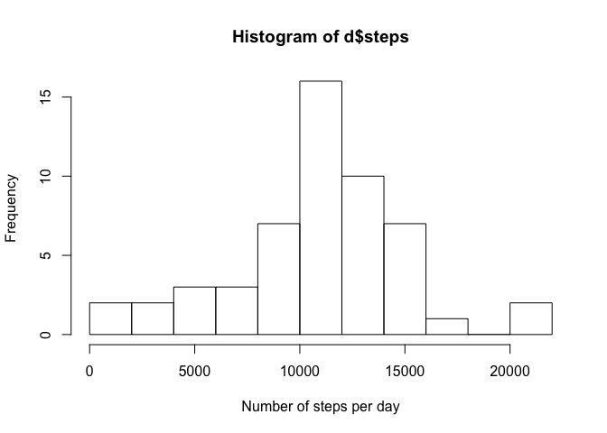
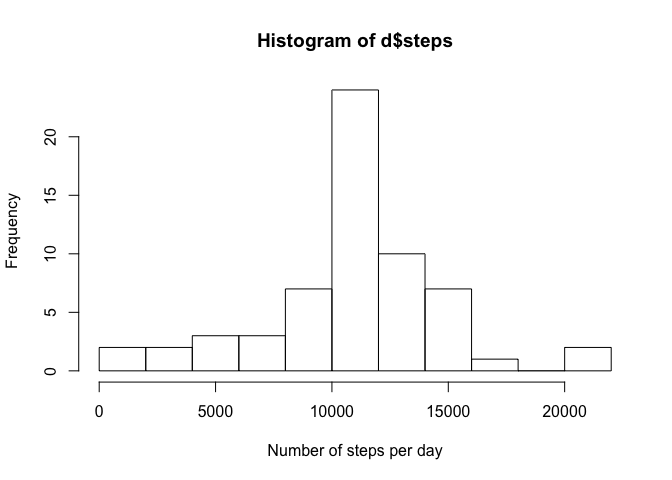
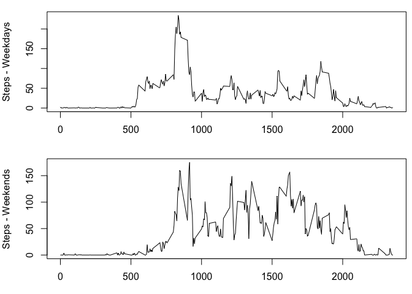

# Reproducible Research: Peer Assessment 1


## Loading and preprocessing the data


```r
library(dplyr) # in this block to disable library load messages
options(scipen=999, digits=6) # this formats inline R chunks more nicely
```

```r
unzip(zipfile = "activity.zip", overwrite = TRUE)
data <- read.csv("activity.csv")
```

## What is mean total number of steps taken per day?

Since the data is provided in 5 minute intervals, in this section we group it by date and use `summarise` to provide histogram and summary of daily data, including mean and median.

### Histogram


```r
data_by_date <- group_by(data, date)
d<-summarise(data_by_date, steps=sum(steps))
hist(d$steps, breaks = 10, xlab="Number of steps per day")
```

 

### Mean and median


```r
summary(d$steps, digits=8)
```

```
##    Min. 1st Qu.  Median    Mean 3rd Qu.    Max.    NA's 
##    41.0  8841.0 10765.0 10766.2 13294.0 21194.0       8
```

The mean is ``10766.188679`` and the median is ``10765``.

## What is the average daily activity pattern?
Group and summarise mean steps by 5 minute interval, then plot a chart showing the profile of an "average" day.

```r
data_by_interval <- group_by(data, interval)
mean_by_interval<-summarise(data_by_interval, steps=mean(steps, na.rm=TRUE))
plot(x=mean_by_interval$interval, y=mean_by_interval$steps, type="s", xlab="Time of day, 5min intervals", ylab="Number of steps")
```

 
The interval with the highest number of steps is ``835``

## Imputing missing values
Replace NA values with the mean value of other samples from the same interval.  I tried to figure out how to do this using `by` or one of the `apply` functions, but settled for a loop instead.  If you have a better way please give me feedback.

```r
data_na_replaced <- data
for (i in which(is.na(data_na_replaced$steps)))
  data_na_replaced[i, ]$steps <- mean_by_interval[which(mean_by_interval$interval==data_na_replaced[i,]$interval),]$steps
```

### Histogram with missing data replaced
There is not much change to the overall profile with the exception of a taller peak around the mean.

```r
data_by_date <- group_by(data_na_replaced, date)
d<-summarise(data_by_date, steps=sum(steps))
hist(d$steps, breaks = 10, xlab="Number of steps per day")
```

 

### Mean and median with missing data replaced
The mean hasn't changed (since we replaced values with the existing mean anyway).  The mean and median were previously close and following the use of the mean as a replacement value, they are now the same.

```r
summary(d$steps, digits=8)
```

```
##    Min. 1st Qu.  Median    Mean 3rd Qu.    Max. 
##    41.0  9819.0 10766.2 10766.2 12811.0 21194.0
```

After replacement of missing data, the mean is ``10766.188679`` and the median is ``10766.188679``.

## Are there differences in activity patterns between weekdays and weekends?

Turns out, people get up later on weekends.


```r
# Convert text to dates
data$date <- as.POSIXct(data$date, "%Y-%m-%d", tz="")  # Have to do this here or dplyr barfs
# Make a boolean that determines weekend (false) or weekday (true)
data$isWeekday <- (weekdays(data$date) != "Sunday" & weekdays(data$date) != "Saturday") 
# Convert the boolean to factors with weekend/weekday levels
data$isWeekday <- factor(data$isWeekday, labels=c("weekend", "weekday"))

data_by_interval <- group_by(data, interval, isWeekday)
mean_by_interval <- summarise(data_by_interval, steps=mean(steps, na.rm=TRUE))
weekdays <- mean_by_interval[mean_by_interval$isWeekday=="weekday",]
weekends <- mean_by_interval[mean_by_interval$isWeekday=="weekend",]

par(mfrow=c(2,1), mai=c(0.6,0.8,0.2,0.1))
plot(x=weekdays$interval, y=weekdays$steps, type="l", xlab="", ylab="Steps - Weekdays")
plot(x=weekends$interval, y=weekends$steps, type="l", xlab="Time of day, 5min intervals", ylab="Steps - Weekends")
```

 
